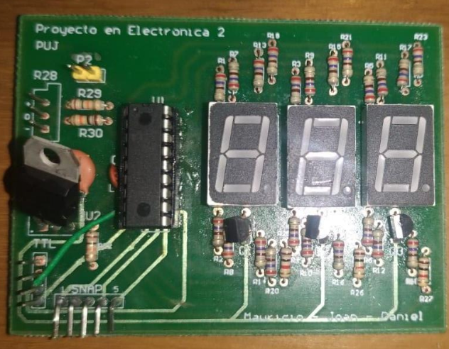
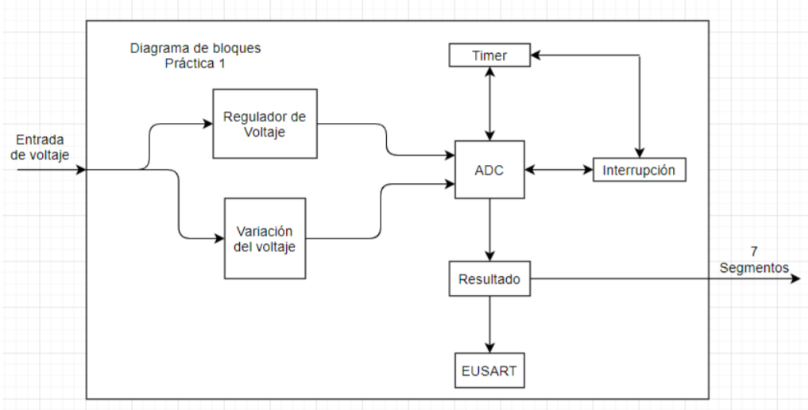
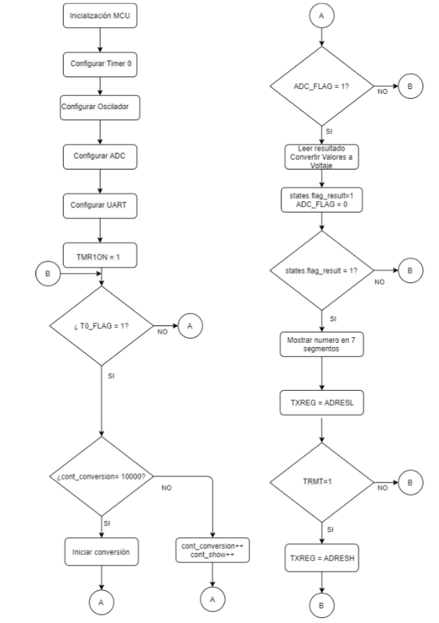
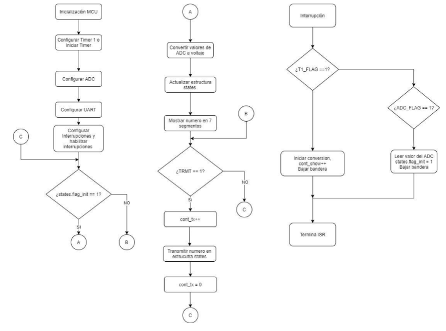
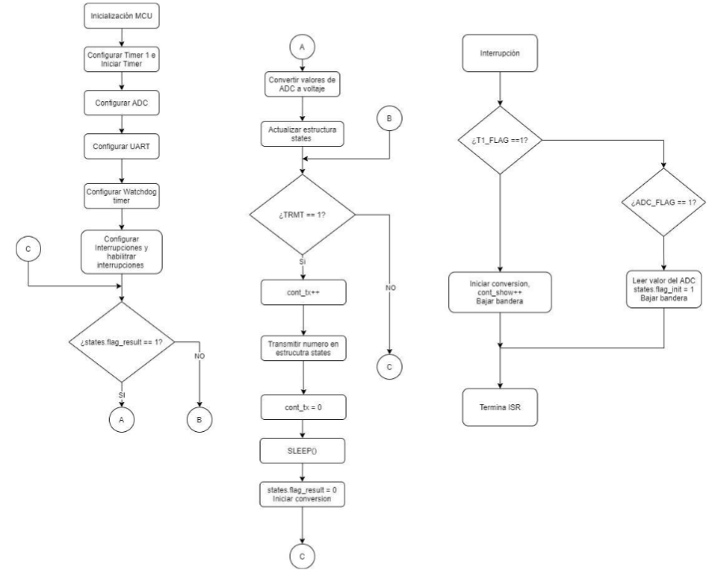

# Laboratorio 1 de Proyecto en electronica II

### Introducción

Diseñar un sistema usando el microcontrolador PIC16F1827-I/P, el cual medirá un voltaje entre 0 y 10 voltios, con una resolución de 0.01 voltios usando tres dígitos. El valor medido se mostrará en tres displays de siete segmentos de cátodo común, conectados en paralelo, de tal forma que se deba hacer uso de la técnica de despliegue dinámico. El microcontrolador tendrá una comunicación serial con un PC por medio de la UART y de un conversor USB-TTL.

### Periféricos usados

* ADC
* EUSART
* I/O ports
* Power-Down Mode \(Sleep\)
* Interrupts
* Timers
* Watchdog Timer

### Diagrama de bloques

### Diagramas de flujo

Para el desarrollo de este proyecto se hicieron tres códigos. Dos corresponde a dos tecnicas de atención a eventos y el ultimo a el uso del modo de bajo consumo.

#### Polling

#### Interrupciones

#### Bajo consumo

